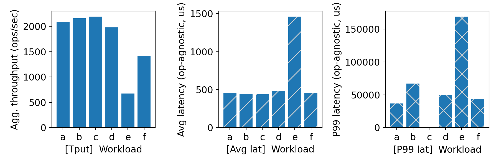
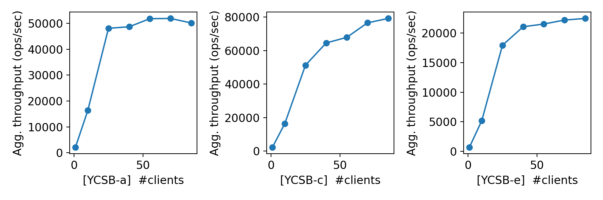
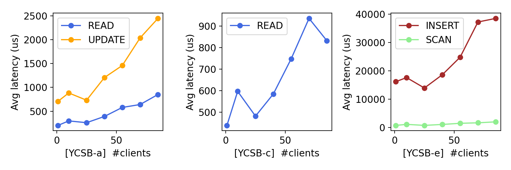
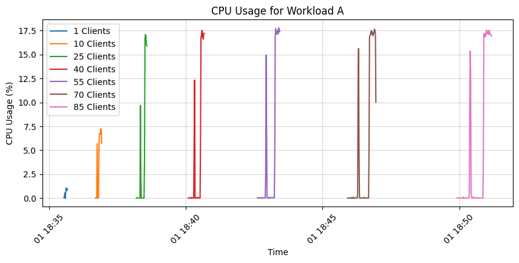
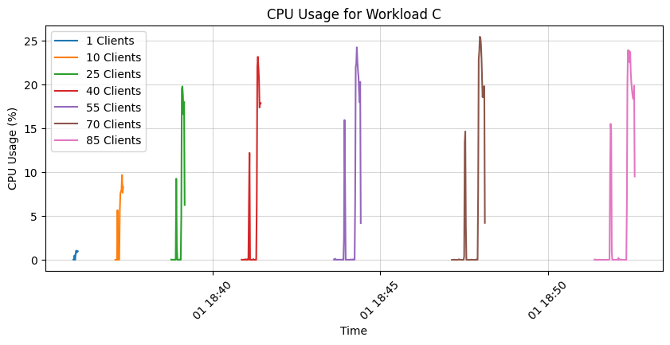
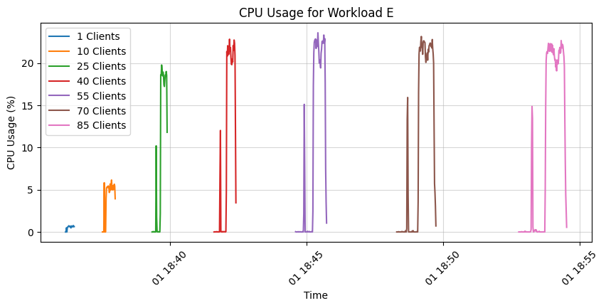
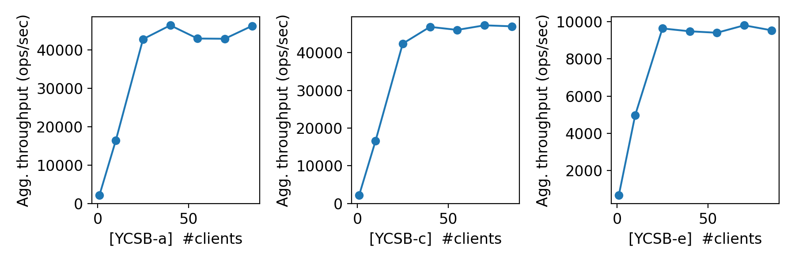
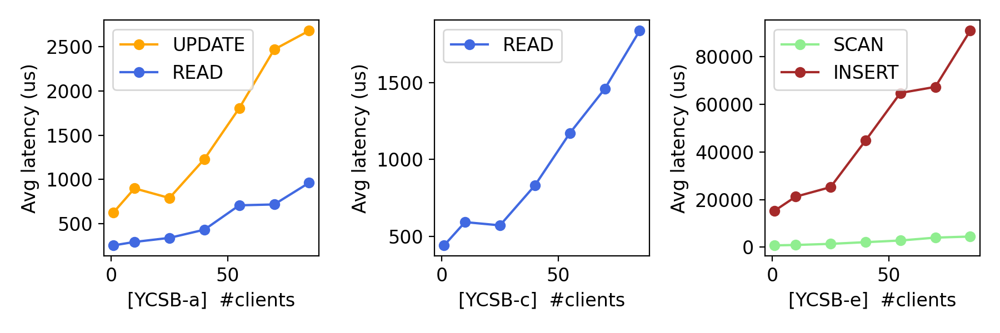
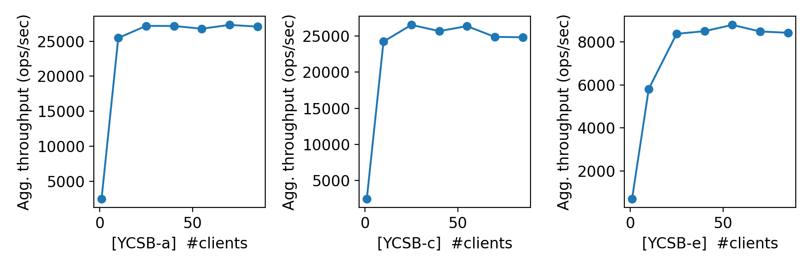
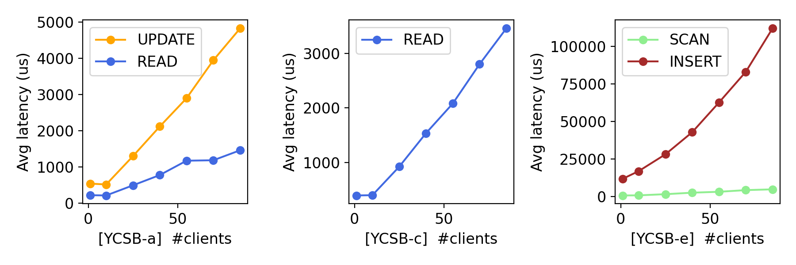

# CS 739 MadKV Project 1

**Group members**: Anusha Kabber `kabber@wisc.edu`, Fariha Tabassum Islam `fislam2@wisc.edu`

## Design Walkthrough

<!-- *DONE: add your design walkthrough text* -->
<!-- Code structure [5%]
Server design [5%]
Explain your RPC protocol between server and clients [5%] -->

We implement this project using **Rust** and use **gRPC** as our RPC protocol for server-client communication. gRPC in Rust is async by default. Therefore, we use asynchronous programming paradigm for this project. Specifically, we implement our gRPC server and gRPC client using the `Tokio` asynchronous runtime.

### Code structure

We structure the project into multiple Rust crates for modularity. Our core implementation consists of three crates:

* `kvstore`: Our key-value store
* `kvserver`: Our gRPC server
* `kvclient`: Our gRPC client

Each we implemented unit tests in each of these crates to quickly verify their correctness during development.

Moreover, we implement

* `kvtester`: Our testing framework
* `scripts/`: Automated scripts to run all the prerequisite `just` commands necessary for generating the report by remote server restart automation

Following we discuss the important components of our project.

### Server Design

#### KV Store

We implement an *in-memory* *thread-safe* *concurrent* key-value store (`struct KVStore`) using a B-tree in crate `kvstore`.
This can perform the required operations: PUT, GET, SWAP, SCAN and DELETE.

We use a read-write lock on the B-tree to make our KV store thread-safe. The read-write lock allows multiple concurrent read access, and exclusive write access. Also, once a write requests the lock, any future reads are blocked; which ensures linearizability.
We initially used a mutex for thread-safety, which did not allow concurrent reads. Switching to read-write lock has significantly improved read performance.

#### Server

We implement a *multi-threaded* gRPC server in the binary crate `kvserver`. 

Our server runs on the default Tokio async multi-threaded runtime and listens for incoming requests. This runtime starts a thread pool with one worker per cpu core, and schedules threads using a work-stealing strategy. Each thread executes tasks asynchronously, hiding IO delay, network communication delay, etc.

This means each incoming request is assigned to a worker. If the requests are read queries, those can be served concurrently from our KV store. If the request is a write query, it waits until it gets exclusive access.
It scales well for read-heavy workload, as we will see in experiments.

#### Client

We implement a *single-threaded* gRPC client in crate `kvclient`. The client communicates with the kvserver using gRPC. The client reads requests from `stdin` in the pre-specified format, sends corresponding gRPC requests to the server, and outputs response to `stdout` in specified format.

### RPC protocol between server and clients

We use the asynchronous Rust `tonic` library for gRPC. gRPC enables efficient client-server communication by using HTTP/2 for transport and Protocol Buffers for serialization. The gRPC messages and services definitions are specified in `kvrpc/kvprc.proto` (Protocol buffer) file. During compilation, the `kvrpc.proto` generates a Rust file `kvrpc.rs`, which is included into both server and client crates. This way, the server and client share the same RPC protocol, ensuring consistency and type safety.

Each of our KV store operation is defined as an RPC service in proto file. Our gRPC service (`MyKVService`) implements each gRPC API (PUT, GET, etc.) by invoking corresponding `KVStore` functions.
```proto
// Our proto file
service KVService {
    rpc Put(PutReq) returns (PutResp);
    rpc Swap(SwapReq) returns (SwapResp);
    rpc Get(GetReq) returns (GetResp);
    rpc Scan(ScanReq) returns (ScanResp);
    rpc Delete(DeleteReq) returns (DeleteResp);
    rpc Length(LengthReq) returns (LengthResp);
}
message PutReq {
    string key = 1;
    string value = 2;
}
...
```

## Self-provided Testcases

<u>Found the following testcase results:</u> 1, 2, 3, 4, 5

We implement five tests in the crate `kvtester`. Each test case is implemented as a separate module and executed based on provided command-line arguments.

<!-- *DONE: add your explanations of each testcase* -->

### Explanations

In tests, whenever we use randomness, we use seed for reproducible result.

#### Test Case 1 [Single client, unit test]

This test verifies the basic functionality of the KV store by performing each operation types a few times with handpicked values. We verify a lot of different edge case scenarios, such as:

* put and get new keys, existing keys, multiple key-value pairs
* swap existing and non-existing keys
* scan a range covering all existing keys, some existing keys, no existing kesy
* delete existing and non-existing keys
* scan (start key > end key)

#### Test Case 2 [Single client, stress test]

This test is a stress test for a single client. It performs `n` random operations ((from all five types of ops)) with some probility of same key reuse.
In each iteration, the client randomly chooses which type of operation to perform, and with some probablity (10%) decides to reuse an old key. This way, we test a wide variety of operation combinations.

To verify the correctness, we internally keep a hashmap based shadow KV store, and after every response from server, match it with the shadow KV store.

We tested upto 10000 operations.

#### Test Case 3 [Multiple clients, non-conflicting keys among clients, stress test]

This is a stress test for `m` clients with non-conflicting keys. Similar to test 2, each client performs `n` random operations (from all five types of ops) with some probablity of key reuse. However, the keyset of each client is distinct from another client.

To verify the correctness of server response, similar to test 2, we keep a shadow KV store
per client.
We keep a logfile performed operations per client to help with debugging.

We tested upto 10 clients, all keys shared, conflicting 10000 ops per client...

#### Test Case 4 [Multiple clients, conflicting keys among clients]

In this test, first two concurrent clients attempt to modify the same key at different times, testing whether changes are properly acknowledged. 

Next, 5 clients performs SWAP and DELETE operations on both shared and separate keys, showcasing how clients affect each other's operations in a concurrent environment. While some swaps were overwritten due to concurrent modifications, this behavior is expected in an eventually consistent system.

#### Test Case 5 [Multiple clients, conflicting keys among clients, stress test]

This is a stress test for `m` clients similar to test 3, however clients have with conflicting keys. Each client performs `n` random operations (SWAP or GET) with some probability of key reuse. We generate `n` keys and share it with all clients. Every operation by a client is done using this shared keyset.

Verifying this was challenging. To verify the correctness of server response, we keep a hashmap based shared shadow KV store with a lock. They kvstore keeps version history (every value) of each key. Whenever a client gets a response, the response is matched with the shadow KV store. If response does not match, the client retries a few times. For example, for swap, client A got `val1` but shadow KV store does not contain `val1` in its history, then client A drops the lock and wait for some time and try again. The rational behind retry is that it is possible `val1` was inserted by another client B before client A sent the request, but B could not acquire the lock to shadow KV store yet.
We also keep a logfile performed operations per client to help with debugging.

We tested upto 10 clients and 10000 ops per clients with all keys shared.

## Fuzz Testing

<u>Parsed the following fuzz testing results:</u>

num_clis | conflict | outcome
:-: | :-: | :-:
1 | no | PASSED
3 | no | PASSED
3 | yes | PASSED

### Comments

<!-- *DONE: add your comments on fuzz testing* -->

Our code passes for three types of fuzz testing:

* Single client
* Concurrent clients, no conflicting keys
* Concurrent clients, conflicting keys

We additionally tested for 100 clients with conflicting keys, which also passed. This shows our KV store provides linearizable service.

Since our client is single-threaded and our KV store engine is thread-safe and linearizable, our solution is linearizable even though we have multi-threaded server.

## YCSB Benchmarking

<u>Single-client throughput/latency across workloads:</u>



<u>Agg. throughput trend vs. number of clients:</u>



<u>Avg. & P99 latency trend vs. number of clients:</u>



### Comments

<!-- *DONE: add your discussions of benchmarking results* -->
We run our experiments on `cloudlab` machine type `c220g5`, which has 2 sockets, 10 CPU core per socket and 2 threads per core, therefore total 40 vCores. The cpu model is Intel(R) Xeon(R) Silver 4114 CPU @ 2.20GHz. It has 187GB memory.

Following is the summary of the YCSB workload operations ratio, which helps to explain the results.

Workload | Operation1 | Operation2
:-: | :-: | :-:
A | READ    50% | UPDATE    50%
B | READ    95% | UPDATE    5%
C | READ   100%
D | READ    95% | INSERT    5%
E | SCAN    95% | INSERT    5%
F | UPDATE  50% | READ    100%

#### Single-client throughput/latency across workloads

Our single client throughput, latency and p99 latency reveals the following interesting findings about our KV store implementations:

* **Scan operations are costly**:
    For workload E, which is scan-heavy, the throughput is the lowest and the latencies are the highest. It implies scans are very costly operation. Eventhough a B-tree keeps the keys in sorted order, we still need to traverse a lot of tree node, and we don't do it concurrently, which makes this operation costly.

* **Reads are very fast**:
    For workload C, which is a read-only workload, the throughput is the highest. Its average and p99 latencies are also the lowest.
    The throughput of other read-heavy workloads (B, D) are almost as high as C. Their latencies are also on the lower group. These imply reads are the fastest, which is reasonable since we allow concurrent reads in our KV store.

* **Access pattern affects throughput**:
    Eventhough workload A and F contains similar number of updates, their access patterns are different. F always reads the old value before each update and A does not; thus, the updates of A are independent of reads. F performing worse than A shows access pattern affects throughput.
    F's access pattern cannot exploit read parallelism, since every read is followed by a write; and, future reads cannot run concurrently to the past reads because of the write.

#### Agg. throughput trend vs. number of clients
<!-- (1 10 25 40 55 70 85) -->

Our throughput trend vs. number of clients reveals the following interesting findings about our implementation:

* The throughput value verifies our findings from single clients:
    1) Scans (Workload E) are very costly (throughput upto 20kops/sec),
    2) Reads (Workload C) are very fast (throughput upto 80kops/sec)

* For workload C (all reads), the throughput scales well upto 85 clients. This is because our implementation allows concurrent reads. Upto ~20 clients, the increase rate is very fast, then still good upto 40, and then scaling slows down. This is because after 20 clients, it crosses NUMA boundary, and after 40 clients, each core needs to run multiple threads which increases contention, cache-misses and context-switches.

* For workload A (mostly reads with 5% update), the throughput scales well upto 25 clients, and then completely saturates. It is because of the write bottleneck of our implementation. Since writes need exclusive access in our implementation, after crossing the NUMA boundary, the cache bouncing due to lock contention and cache coherence traffic hurts scalability.

* For workload E (mostly scans), the throughput scales well upto 25 clients and increases a little bit till 40 clients then saturates. After 20 clients, this workload also suffers from NUMA effect. However, since scans are reads, multiple scans can run concurrently, therefore, it still scales a little bit till 40 clients and then completely saturates.

#### Avg. & P99 latency trend vs. number of clients

Our latency trend vs. number of clients reveals the following interesting findings:

* Workload A shows the latency of an update is higher than a read.  Also, the update latency increase rate is higher than reads. This is expected, since writes are not concurrent in our implementation.

* Workload C shows that read latency increases with number of client. It is because of contention and scheduling overhead, since more readers are competing for resources.

* The trend of workload E reveals that an average insert operation is costlier than an average scan operation. This is reasonable since writes need to wait for all readers to leave in a read-write lock. Moreover, inserts might need to restructure multiple btree nodes. In contrast, scans are reads and they benefit from read parallelism of the read-write lock. As the number of clients increases, insert latency increases more rapidly since write contention increases.

* In each latency plot, there is a spike in latency at 10 clients, which again decreases at 25 clients. At 10 clients, hyperthreading kicks in latency starts reducing. At around ~20 clients, loads get optimally distributed across all cpu cores, reducing latency. After that, as load increases, lock contention, cache bouncing, context-switches keeps increasing the latency.

## Additional Discussion

### Avg. cpu load for workload A, C and E for our server





This figure shows that workload C makes the most efficient use of cpu due to its high concurrency. However, Workload A makes the least use due its high number of write operation which is not concurrent in our KV store. This figure also shows that our server is not CPUbound.
However, since, even workload C is not using full cpu capacity, our implementation has room for improvement. 

### Agg. throughput trend vs. number of clients for multi-threaded server with mutex




This figure shows that using mutex instead of read-write lock in a multi-threaded server reduces throughput significantly (20 to 50%). This also increases latency. 
These figures validate our decision of using read-write lock.


### Agg. throughput trend vs. number of clients for single-threaded server with read-write lock




This figure shows that using single thread reduces throughput even further. The latency also increases further. It is clear single-threaded implementation is not scalable beyond 10~20 clients. 

