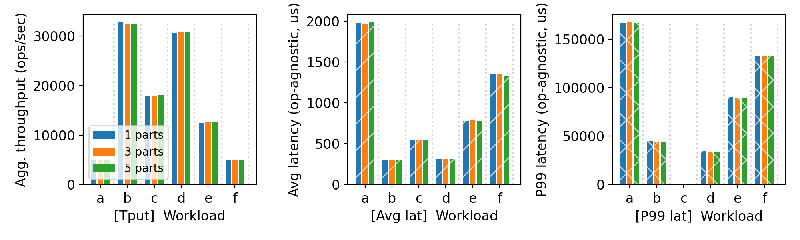
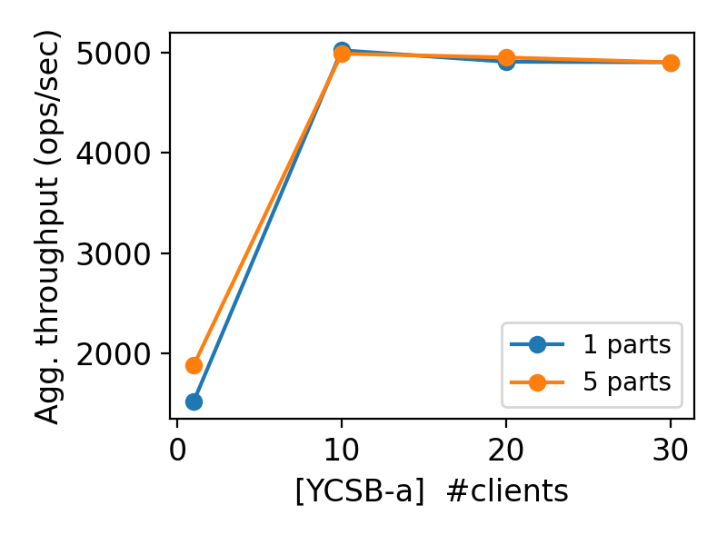
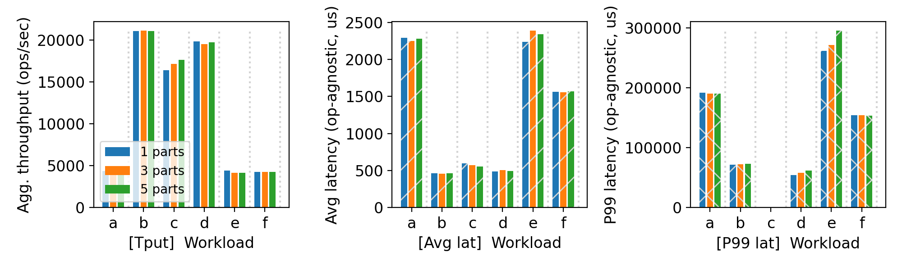
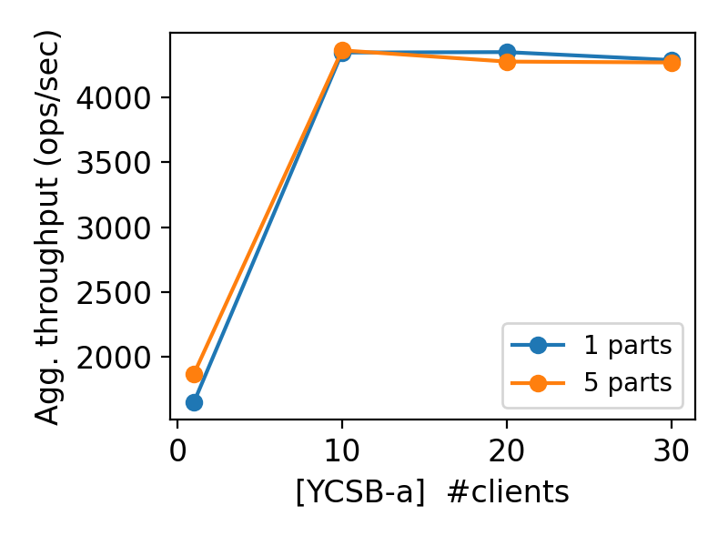

# CS 739 MadKV Project 2

**Group members**: Fariha Tabassum Islam `fislam2@wisc.edu`, Anusha Kabber `kabber@wisc.edu`

## Design Walkthrough

<!-- *DONE: add your design walkthrough text* -->
Our project is divided into `kvserver`, `kvclient`, `kvstore` and `test_scripts`

Following is brief description of our design:

### Storage backend: 

We have implemented two storage backends.
- Using `RocksDB`, since rocksdb can provide durability and consistency with apporopriate settings, so we don't need worry.
- Using our p1 in-memory btree as state machine and a simple append-only log with serialization with the help of protobuf. We stored the log entry size and checksum per log entry, so that if an entry gets corrupted during crash, we can detect it. You ensured consistency by flushing the log to disk before acknowledging clients.

#### Server recovery: 

RocksDB can do self recovery upon restart given old directory. In our protobuf log, upon restart we replay all correct log entry on our in-memory b-tree. If we detect a checksum corruption, we remove that entry. 

#### Keyspace Partitioning: 

We use simple range based partitioning. For `n` servers, we divide keyspace into `n`*`factor` ranges and each server gets `factor` number of partitions. The reason is scan will be little bit faster if the scan covers a large number of servers, then scan can happen parallelly.

#### Cluster manager: 
As specified, clients and servers query the manager. Upon start server register to manager and are assigned a few range partitions. Upon start, clients query manager determine partition mappings.

#### Error Handling: 
As specified, upon failure, indefinite retry is done.


## Self-provided Testcase

Testcase 1 setup: 1 Manager, 3 Server nodes
```
Perform multiple PUT and SWAP operations to store and update key-value pairs across different partitions.

Perform multiple GET and SCAN operations to verify data consistency; all should succeed.

Kill one of the servers responsible for a partition.

Perform GET and SCAN on unaffected partitions, which should continue to succeed.

Perform GET or SCAN involving the failed partition, which should timeout.

Restart the failed server process for the partition.

Perform a GET on a key from the recovered partition, which should succeed and return its latest value.
```

Testcase 2 setup: 1 Manager, Multi Server

```
Start the Manager process with the specified manager address and server list.

Launch a random number of Server processes (between 1 and 30), each with:

  Unique server ID.
  
  Listening on a unique port.
  
  A separate data directory for persistence.

Wait for the servers to stabilize and register with the Manager.

Fetch and display the partition mapping from the Manager using the client.

Define a set of predefined keys to operate on (e.g., alpha, beta, gamma, ..., omega).

Perform PUT operations for all the keys to store initial key-value pairs.

Map each key to its responsible server based on the partition information.

Randomly kill up to half of the running servers to simulate server failures.

Perform GET operations for each key:

  If the key belongs to an alive server, the GET should succeed.
  
  If the key belongs to a failed server, the GET should timeout.

Print the result of each GET operation, highlighting successes and expected timeouts.

Clean up by terminating any remaining running processes (Manager and Servers).
```

To run: 

Testcase1: 
```just p2 test1 <manageripaddr> <serveripaddr>```
Testcase2: 
```just p2 test2 <manageripaddr> <serveripaddr>```

### Explanations

Testcase1: This deterministic test validates partition availability, failure detection, timeout handling, and successful recovery with data integrity. Healthy partitions remain available during a partial server failure. Operations targeting the failed partition behave expectedly. 

Testcase2: This test focuses on validating the scalability, fault tolerance, and partition handling of the distributed key-value store under randomized conditions, unlike the first test, which follows a fixed, deterministic scenario. By launching a random number of servers (1–30) and injecting random server failures (up to half of the servers), this test simulates unpredictable, real-world conditions to uncover scalability issues, validate dynamic partition-to-server mappings, and ensure correct timeout handling when partitions become unavailable. Unlike the first test, it emphasizes automated fault detection, stress testing, and resilience across varying cluster sizes, complementing the more controlled and structured approach of the first test.

## Fuzz Testing

<u>Parsed the following fuzz testing results:</u>

num_servers | crashing | outcome
:-: | :-: | :-:
3 | no | PASSED
3 | yes | PASSED
5 | yes | PASSED

You will run a crashing/recovering fuzz test during demo time.

### Comments

*DONE: add your comments on fuzz testing*
As instructed, we kill and restart server 1 in num_servers = 3 and server 1 and 2 in num_servers 5 in the middle of fuzzing. Our server upon restart first replays the full log and then starts serving requests.


## YCSB Benchmarking

<u>10 clients throughput/latency across workloads & number of partitions:</u>



<u>Agg. throughput trend vs. number of clients w/ and w/o partitioning:</u>



### Comments


<!-- *DONE: add your discussions of benchmarking results* -->
We run our experiments on `cloudlab` machine type `c220g5`, which has 2 sockets, 10 CPU core per socket and 2 threads per core, therefore total 40 vCores. The cpu model is Intel(R) Xeon(R) Silver 4114 CPU @ 2.20GHz. It has 187GB memory. We ran all of the servers and clients in the same machine. 

Following is the summary of the YCSB workload operations ratio, which helps to explain the results. The figures are from our state machine and log implementation.

Workload | Operation1 | Operation2
:-: | :-: | :-:
A | READ    50% | UPDATE    50%
B | READ    95% | UPDATE    5%
C | READ   100%
D | READ    95% | INSERT    5%
E | SCAN    95% | INSERT    5%
F | UPDATE  50% | READ    100%

#### 10 clients throughput/latency across workloads & number of partitions

Following are our observations:
1. The effect of partitioning keys are not visible. There are a few possible reasons for that.
    - The partition scheme we used is static and not data-aware. So, even with multiple partitions, we could not leverage much parallelism.
    - We ran all the servers and clients in the same machine, which might have added noise in the actual perfomance of servers.
    - Our implementation could have utilized the 
2. As expected, the latency and p99 latency of update-heavy workloads (A, F) are the highest. 
3. Surprisingly, reads with a little bit of update and insert (B, D) has higher throughput than read-only (C). The reads access a few keys mostly, therefore, the load is highly concentrated on one server. Though our reads are concurrent, still overloads one server causing bad performance. Our implementations does not handle load distribution for hot keys.

#### Agg. throughput trend vs. number of clients w/ and w/o partitioning


Following are our observations:
1. As mentioned before, increasing partions does not improve or degrade performance.
2. The throughput gets saturated at 10 clients. A possible reason is the workload is bottlenecked by disk writes due to forcing log to disk. 


In summary, our implementation needs good dynamic load balancing to leverage the benefit of partitioning.

## Additional Discussion

<!-- *OPTIONAL: add extra discussions if applicable* -->
#### With RocksDB as storage backend

<u>10 clients throughput/latency across workloads & number of partitions:</u>



<u>Agg. throughput trend vs. number of clients w/ and w/o partitioning:</u>



Surprisingly, the performance is worse with rocksdb. It is possible that rocksdb does a lot of advanced optimization and supports a variety of flexibility but for simple workloads like these, the overhead of the persistent and consistent logging is higher than our simple protobuf based concise log.