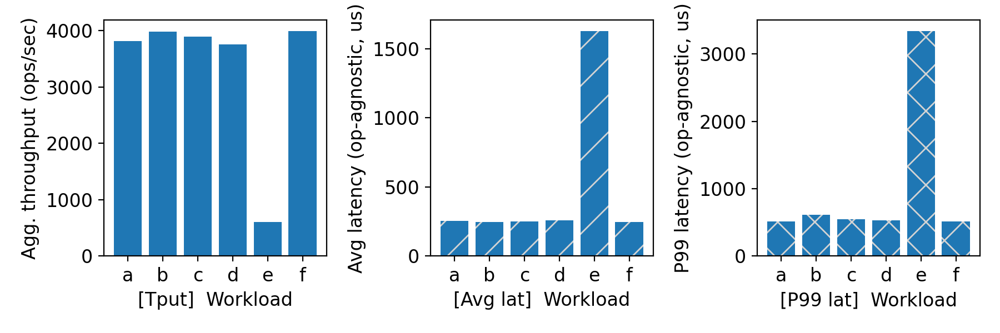
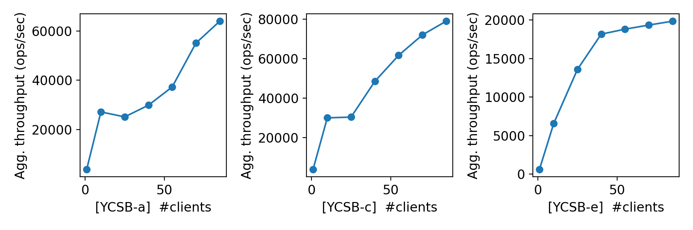
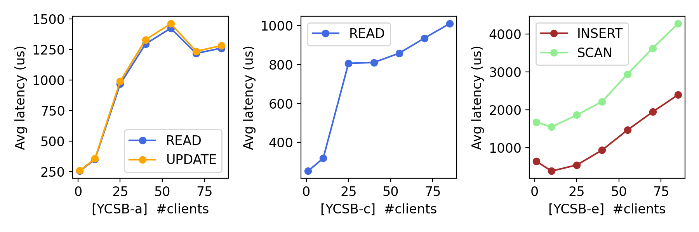

# CS 739 MadKV Project 1

**Group members**: Name `email`, Name `email`

## Design Walkthrough

Code structure: 

The project is split into three parts:
-  `kvstore/server/main.go` for the gRPC server, 
- `kvstore/client/main.go` for the CLI + stdin/stdout client, and 
- `.proto` files under `kvstore/proto/` with generated stubs in `kvstore/gen/kvpb/`. 

The Justfile recipes in `justmod/proj1.just` drive builds and tests, while the core logic lives in the server and client binaries. This keeps API definitions, server state, and test automation clearly separated.

Server design: 

The server holds all data in an in-memory `btree.BTree` guarded by a single `sync.Mutex`, so each RPC is serialized for correctness. `PUT`, `GET`, and `DELETE` are direct tree operations, and `SCAN` uses an ascending iterator to return an inclusive range. `SWAP` returns the old value if present and inserts/updates the stored value atomically under the lock (like an UPSERT).

RPC protocol: 

The protocol is a simple unary gRPC API defined in `kvstore.proto` with `Put/Get/Swap/Delete/Scan` RPCs and explicit request/reply messages. The client supports a structured stdin/out format (one command per line) and prints normalized responses (`found`/`not_found`, `null`, `SCAN BEGIN/END`) that the provided tests and harnesses can parse. In CLI mode it also exposes flags for one-off RPCs to simplify manual debugging.

## Self-provided Testcases

<u>Found the following testcase results:</u> 1, 2, 3, 4, 5

You will run some testcases during demo time.

testcase | outcome
:-: | :-:
1 | PASSED
2 | PASSED
3 | PASSED
4 | PASSED
5 | PASSED

### Explanations

Test1 (single client, basic flow): Exercises `PUT/GET/SWAP/SCAN/DELETE` in a simple, linear sequence. The output confirms that `PUT` returns `not_found` on first insert, `SWAP` returns the old value, `SCAN` prints both keys in range, and the deleted key reads back as `null`. Coverage: happy-path correctness for all core operations and scan formatting.

Test2 (single client, edge/error cases): Mixes missing-key operations, an empty-range `SCAN`, and malformed commands (`PÜT`, missing args, extra args) to verify the client emits protocol-compliant error messages. The output should show `null`/`not_found` for missing keys and specific error lines for invalid inputs. Coverage: input validation, error handling, and protocol robustness.

Test3 (two clients, disjoint keys): Runs two clients concurrently on different keys with full CRUD and swap. The outputs show both clients see their own updates and deletes without interference. Coverage: concurrency without conflicts, per-key isolation, and correctness under parallel execution.

Test4 (two clients, overlapping key): Interleaves two clients sharing one key and scanning ranges. Outputs validate that one client observes a non-null value for the shared key, `PUT` on existing key returns `found`, and scans use proper `BEGIN/END` markers. Coverage: correctness under contention and scan behavior with concurrent updates.

Test5 (three clients, higher contention): Three clients overlap on a shared key with staggered starts and deletes. Outputs show `SWAP` returns the expected old value, deletes take effect, and later `GET` returns `null`. Coverage: multi-client interleavings, visibility of updates/deletes, and ordering under higher concurrency.

Coverage discussion: Together, the self-written tests cover all five operations (`PUT/GET/SWAP/DELETE/SCAN`), both success and missing-key cases, and a range of concurrency patterns (single client, disjoint keys, shared keys, and three-way contention). They also validate the stdin/stdout protocol’s error handling (invalid keywords and argument counts). Gaps remain around large scans, long-running stress, and performance under high client counts; these would require extended or randomized workloads beyond the current deterministic tests.
All results are asserted against expected outputs in the test scripts to ensure correctness.

## Fuzz Testing

<u>Parsed the following fuzz testing results:</u>

num_clis | conflict | outcome
:-: | :-: | :-:
1 | no | PASSED
3 | no | PASSED
3 | yes | PASSED

You will run a multi-client conflicting-keys fuzz test during demo time.

### Comments

Fuzz testcases: I ran three configurations: 1 client without conflicts, 3 clients without conflicts, and 3 clients with conflicting keys. The logs indicate all runs completed successfully with no assertion failures or malformed responses.

Outputs and coverage: The no-conflict runs exercise random mixes of operations without interference, which is good for validating basic correctness across a wider key space. The conflict run is the most valuable for coverage because it stresses concurrent updates, visibility, and the server’s ability to serialize operations while keeping the protocol outputs consistent. What it does not cover is long-duration stress, large scans, or high client counts; increasing runtime or clients would improve coverage of rare interleavings.

## YCSB Benchmarking

<u>Single-client throughput/latency across workloads:</u>

<u>Agg. throughput trend vs. number of clients:</u>

<u>Avg. latency trend vs. number of clients:</u>

### Comments

Across workloads, read-heavy mixes tend to show higher single-client throughput and lower latency than write-heavy mixes, which is consistent with simpler read paths and less mutation overhead. 

As the number of clients increases, aggregate throughput rises at first but then flattens while average latency climbs, indicating queueing and contention under load. 

The main scalability bottleneck is the server’s single global mutex protecting the in-memory tree, which serializes all operations and limits parallelism; adding clients mostly increases waiting time rather than throughput once the server saturates. 

Overall, the trends are similar across workloads (increase then plateau), with differences in the plateau level and latency slope driven by read/write mix.

## Additional Discussion

*OPTIONAL: add extra discussions if applicable*
