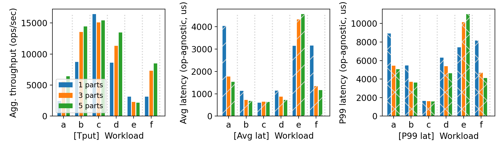
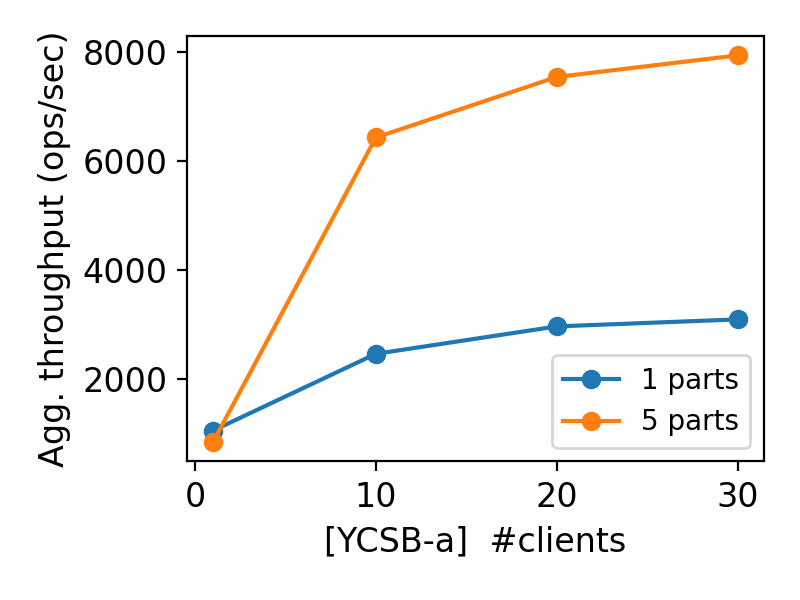

# CS 739 MadKV Project 2

**Group members**: Name `email`, Name `email`

## Design Walkthrough

*FIXME: add your design walkthrough text*

## Self-provided Testcase

You will run the described testcase during demo time.

### Explanations

*FIXME: add your explanation of this testcase*

## Fuzz Testing

<u>Parsed the following fuzz testing results:</u>

num_servers | crashing | outcome
:-: | :-: | :-:
3 | no | PASSED
3 | yes | PASSED
5 | yes | PASSED

You will run a crashing/recovering fuzz test during demo time.

### Comments

*FIXME: add your comments on fuzz testing*

## YCSB Benchmarking

<u>10 clients throughput/latency across workloads & number of partitions:</u>

<u>Agg. throughput trend vs. number of clients w/ and w/o partitioning:</u>

### Comments

*FIXME: add your discussions of benchmarking results*

## Additional Discussion

*OPTIONAL: add extra discussions if applicable*

