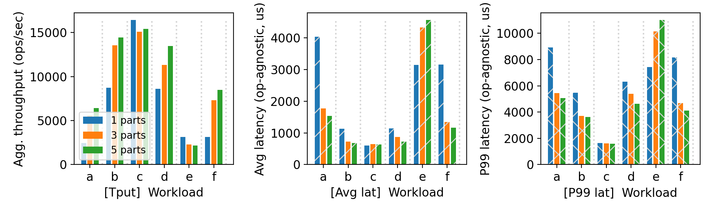
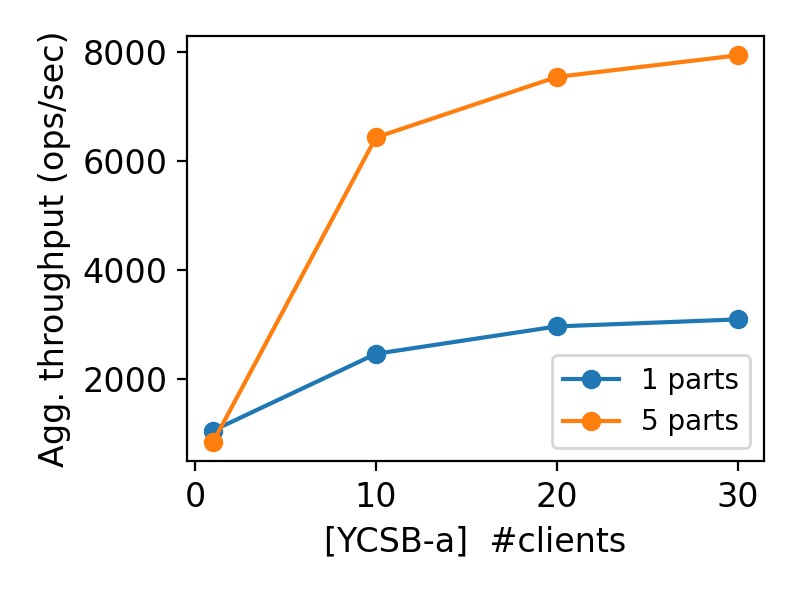

# CS 739 MadKV Project 2

**Group members**: Soumya Sistla `ssistla@wisc.edu`, Amith Bhat Nekkare `bhatnekkare@wisc.edu`

## Design Walkthrough

### 1. Code Components Structure

The MadKV system is implemented in Go using gRPC for communication and consists of three main components:

**Manager** : A centralized cluster coordination service that tracks server registrations and provides cluster metadata to clients. The manager implements the `ClusterManager` gRPC service with two RPC methods: `RegisterServer` (for server registration with assigned IDs) and `FetchClusterInfo` (for clients to discover server addresses and cluster readiness). The manager maintains an in-memory registry of server addresses indexed by server ID.

**Server** : Individual storage nodes that handle all KV operations (Get, Put, Swap, Delete, Scan) through the `KVS` gRPC service. Each server uses an in-memory B-tree for fast lookups and sorted iteration, backed by a SQLite-based write-ahead log for durability. Servers enforce partition ownership by validating that incoming requests target keys belonging to their assigned partition, rejecting misrouted requests with `FailedPrecondition` errors.

**Client** : Implements client-side routing logic by fetching the partition map from the manager, then directly communicating with the appropriate server for each operation. The client calculates partition ownership using the same hash function as servers to ensure consistency. Supports both interactive CLI mode and stdin/stdout mode for scripted testing.

**Protocol Definitions** (`kvstore/proto/`): All RPC interfaces and message formats are defined using Protocol Buffers (kvstore.proto, manager.proto, wal.proto), providing type-safe, versioned communication between components.

### 2. Durability/Recovery Design

Our durability implementation uses a write-ahead logging (WAL) architecture backed by SQLite:

**Persistence Strategy**: All mutations (Put, Swap, Delete) are serialized as protobuf-encoded `WALCommand` messages and appended to a SQLite table (`wal_log`) with `PRAGMA synchronous = FULL` and `PRAGMA journal_mode = WAL`. Each command receives a monotonically increasing sequence number. The SQLite database file (`commands.db`) resides in the server's backer directory (default: `data/`, configurable via `--backer` flag).

**Write Path**: Before acknowledging any mutation to the client, the server atomically writes both the WAL entry and a deduplication cache entry within a SQLite transaction (`server/main.go:appendLogTx`). This ensures that either both records are persisted or neither, maintaining consistency. SQLite's FULL synchronous mode guarantees fsync to disk before returning, ensuring durability even if the server crashes immediately after acknowledgment.

**Recovery Path**: On startup, the server reads the entire `wal_log` table in sequence order and replays each command against the in-memory B-tree (`server/main.go:replayLog`). This reconstructs the exact state that existed before the crash. The replay process validates all operations and rebuilds the deduplication cache to prevent re-execution of already-processed mutations.

**Deduplication Mechanism**: To support idempotent retries, each mutation carries a unique request ID (format: `{clientPID}-{clientNano}-{sequence}`). The server maintains an in-memory cache mapping request IDs to their outcomes, persisted alongside WAL entries. If a duplicate request arrives, the server returns the cached result without re-applying the mutation, preventing double-updates during client retries after crashes or network failures.

### 3. Partitioning Design & Manager

**Partitioning Strategy**: We implement hash-based partitioning using FNV-32a hashing with modulo arithmetic: `partition_id = hash(key) % num_servers`. This function is implemented identically in both client and server code (`ownerForKey` in `kvstore/common/partition.go`) to ensure routing consistency. The deterministic hash function provides even key distribution across servers while remaining simple and fast.

**Manager Responsibilities**: The cluster manager assigns each server a unique zero-indexed ID during registration and maintains a registry mapping server IDs to their gRPC addresses. When clients query `FetchClusterInfo`, the manager returns the complete address list and a readiness flag (true when all expected servers have registered). The manager itself is stateless—server assignments are determined purely by registration order, and the manager holds no partition ownership information beyond the address mappings.

**Client-Side Routing**: Clients fetch the cluster configuration once at startup and cache the server address list locally. For each operation, the client computes the target partition using `ownerForKey(key, num_servers)` and directly contacts the corresponding server without manager involvement. This design eliminates the manager as a performance bottleneck since it only handles infrequent configuration queries rather than per-operation routing decisions.

**Partition Enforcement**: Each server validates incoming requests by computing the expected owner for the key and comparing it against its own server ID (`server/main.go:validateKeyOwner`). If the key belongs to a different partition, the server immediately rejects the request with a `FailedPrecondition` error, ensuring strict partition isolation. This prevents accidental cross-partition operations and maintains the correctness of the distributed system.

### 4. Error and Timeout Handling

**Server → Manager**: During startup, servers attempt to register with the manager using an infinite retry loop with exponential backoff (`server/main.go:registerWithManager`). Each RPC has a 2-second timeout, and failed attempts are retried after 1 second. This blocks server startup until the manager is available, ensuring servers don't begin serving requests without cluster coordination.

**Client → Manager**: Clients similarly retry manager connections indefinitely when fetching cluster information (`client/main.go:fetchClusterInfo`). The client waits for the cluster to report ready status (all servers registered) before proceeding with KV operations, preventing premature requests to incomplete clusters.

**Client → Server**: All client operations implement indefinite retry with connection pooling. When an RPC fails (network error, timeout, or server crash), the client logs the failure, closes the stale connection, and retries the operation after a 1-second delay (`client/main.go:callSingleServer`). For mutations, the client reuses the same request ID across retries, leveraging server-side deduplication to ensure idempotency. The default RPC timeout is 2 seconds per attempt.

**Graceful Degradation**: When a server crashes, clients targeting that partition will experience RPC failures and begin retrying. Operations to other partitions continue unaffected, demonstrating partition isolation. Once the crashed server recovers and replays its WAL, clients automatically reconnect and resume operations without manual intervention, achieving transparent fault tolerance.

## Self-provided Testcase

You will run the described testcase during demo time.

### Explanations

This testcase validates both partition isolation and crash recovery in a 3-server cluster. We launch the cluster with 3 partition servers and perform a series of Puts and Swaps across keys that hash to different partitions. We then verify correctness with Gets and Scans, all of which should return their latest written values.

Next, we kill one server (server 1) to simulate a crash. We immediately verify that Gets and Scans targeting keys owned by the surviving partitions (servers 0 and 2) continue to succeed without interruption, demonstrating fault isolation. We then issue a Get or Scan for a key owned by the failed partition (server 1), which should time out since the server is unreachable.

Finally, we restart server 1 with the same backer directory. The server replays its WAL on startup, reconstructing its in-memory state from persisted log entries. We then issue a Get for a key that was previously written to that partition — it should return the correct latest value, confirming that durability and recovery are working correctly.

The test is automated - and can be run using `just p2::testcase`

## Fuzz Testing

<u>Parsed the following fuzz testing results:</u>

num_servers | crashing | outcome
:-: | :-: | :-:
3 | no | PASSED
3 | yes | PASSED
5 | yes | PASSED

You will run a crashing/recovering fuzz test during demo time.

### Comments

The experiments confirmed proper partition isolation: failures only affected the partition hosted by the crashed server, while other partitions continued serving requests without interruption. During crashes, clients targeting the affected partition temporarily stalled but eventually succeeded once the server recovered and reloaded its persisted state. Across all fuzz runs, the system maintained consistent state and no linearizability violations were observed, demonstrating correct interaction between partition routing, retry logic, and recovery mechanisms.

## YCSB Benchmarking

<u>10 clients throughput/latency across workloads & number of partitions:</u>

<u>Agg. throughput trend vs. number of clients w/ and w/o partitioning:</u>

### Comments

The benchmarking results demonstrate clear performance benefits from partitioning, though with workload-dependent variations. Analyzing the 10-client experiments across partition counts:

**Throughput scaling**: Read-heavy workloads (B, C, D) exhibited the strongest scaling, with workload C achieving ~17,000 ops/sec at 5 partitions compared to ~8,500 ops/sec at 1 partition (2x improvement). Balanced workloads (A, F) showed moderate scaling to ~13,000-15,000 ops/sec with 5 partitions. Workload E (scan-intensive) performed poorly across all configurations (~3,000 ops/sec), as scans must traverse multiple partitions and cannot effectively parallelize.

**Latency improvements**: Adding partitions reduced both average and P99 latencies for most workloads by distributing load and reducing per-server contention. Read-heavy workloads showed average latencies of 500-1,500 us with 5 partitions compared to 1,000-4,000 us with 1 partition. Workload E exhibited significantly higher latencies (3,000-4,000 us average, 10,000-11,000 us P99) due to the cross-partition coordination overhead inherent to scan operations.

**Client scaling characteristics**: The throughput-vs-clients trend reveals the scalability advantage of partitioning. With 1 partition, throughput plateaued at ~3,000 ops/sec around 20 clients, indicating server saturation (likely disk I/O bottleneck from durability overhead). With 5 partitions, throughput scaled more linearly, reaching ~8,000 ops/sec at 30 clients (2.67x speedup), demonstrating that load distribution across servers delays saturation and increases aggregate capacity.

**Bottleneck analysis**: The single-partition configuration is constrained by per-server durability overhead (fsync operations), while the multi-partition setup distributes this cost. The non-linear scaling (5 partitions != 5x throughput) suggests additional bottlenecks: potential client-side limitations, network overhead from cross-partition routing, or uneven key distribution causing load imbalance. The system shows room for further scaling given that 5 partitions at 30 clients achieved 8,000 ops/sec, suggesting more clients or servers could push higher.

## Additional Discussion

**Partition count vs. performance trade-offs**: While our results show throughput improvements with more partitions, the scaling is sublinear (5 partitions yielded ~2x throughput, not 5x). This suggests diminishing returns beyond a certain point. The overhead includes client-side partition routing complexity, potential load imbalance from hash-based partitioning, and increased operational complexity. For production systems, the optimal partition count depends on workload characteristics, hardware capabilities, and operational requirements.

**Scan operation limitations**: Workload E's poor performance across all configurations highlights a fundamental limitation of our partitioning scheme. Since scans must aggregate results from multiple partitions sequentially or with coordination overhead, they cannot benefit from parallelization. Future optimizations could include range-based partitioning for scan-heavy workloads, scan result streaming to overlap network and computation time, or caching frequently scanned ranges.

**Durability vs. performance**: The single-partition plateau at ~3,000 ops/sec strongly suggests disk I/O saturation from fsync operations required for durability. Potential optimizations include: batch commits to reduce fsync frequency while maintaining correctness, group commit techniques where multiple client operations share a single fsync, or leveraging higher-performance storage (NVMe SSDs, persistent memory) to reduce durability overhead. These techniques would enable higher throughput without sacrificing crash consistency guarantees.

