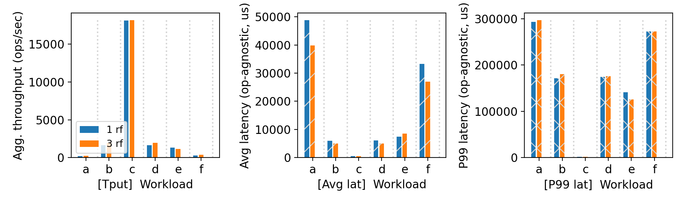
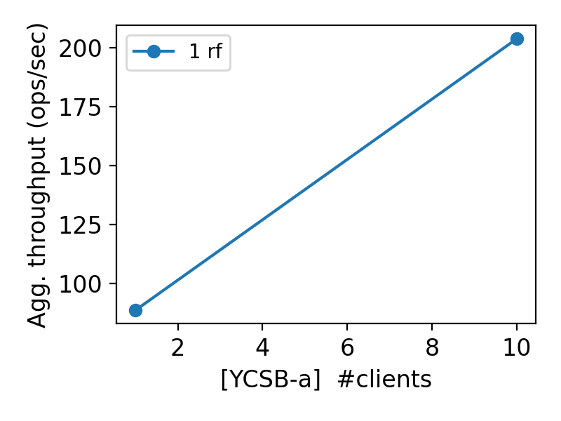

# CS 739 MadKV Project 3

**Group members**: Name `email`, Name `email`

## Design Walkthrough

*FIXME: add your design walkthrough text*

## Self-provided Testcases

You will run the four described testcase scenarios during demo time.

### Explanations

*FIXME: add your explanations of each testcase*

## Fuzz Testing

<u>Parsed the following fuzz testing results:</u>

server_rf | crashing | outcome
:-: | :-: | :-:
5 | no | PASSED
5 | yes | PASSED

You may be asked to run a crashing fuzz test during demo time.

### Comments

*FIXME: add your comments on fuzz testing*

## YCSB Benchmarking

<u>10 clients throughput/latency across workloads & replication factors:</u>

<u>Agg. throughput trend vs. number of clients with different replication factors:</u>

### Comments

*FIXME: add your discussions of benchmarking results*

## Additional Discussion

*OPTIONAL: add extra discussions if applicable*

