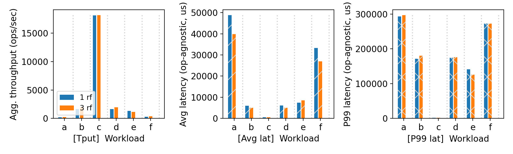
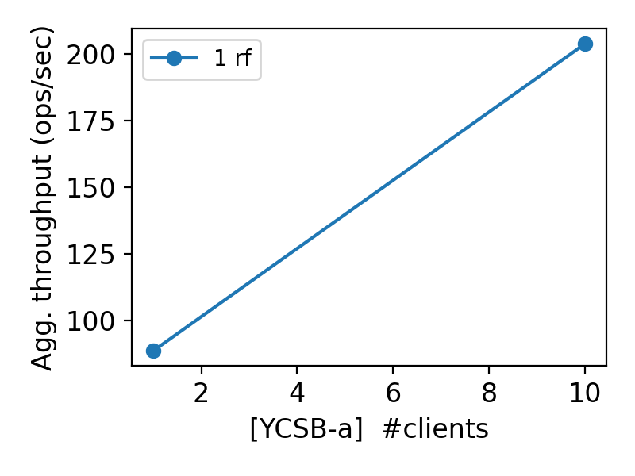

# CS 739 MadKV Project 3

**Group members**: Soumya Sistla `ssistla@wisc.edu`, Amith Bhat Nekkare `bhatnekkare@wisc.edu`

## Design Walkthrough

Code structure: 

The project now has four main pieces for P3:
- `kvstore/server/main.go` for the replicated KV server (client-facing KV RPCs + internal Raft peer RPCs),
- `kvstore/client/main.go` for the routed CLI + stdin/stdout client,
- `kvstore/manager/main.go` for cluster registration/topology RPCs, and
- `.proto` files under `kvstore/proto/` (KV, manager, WAL, and Raft) with generated stubs in `kvstore/gen/kvpb/`.

The Justfile recipes in `justmod/proj3.just` drive build/test/service/fuzz/bench workflows, and helper scripts (`local-rf5.sh`, `cloudlab-run.sh`) orchestrate local and multi-node fault scenarios. This keeps protocol definitions, runtime state-machine logic, and experiment automation clearly separated.

Server design: 

The server still keeps applied KV state in an in-memory `btree.BTree` behind a `sync.Mutex`, but writes now flow through Raft replication instead of local direct apply. Each replica persists Raft metadata and log entries in SQLite (`raft_meta`, `raft_log`) and rebuilds committed state on restart. Leader replicas append commands, replicate to peers via `AppendEntries`, and only acknowledge mutations after majority commit and apply. Followers reject client writes with leader hints, and reads are gated so a leader serves them only after committing an entry from its current term. `SWAP`/`PUT`/`DELETE` remain atomic from the client perspective through this replicated state-machine path.

RPC protocol: 

The protocol is now split across three unary gRPC services:
- KV RPCs (`Put/Get/Swap/Delete/Scan`) for client operations,
- manager RPCs (`RegisterServer`, `GetClusterInfo`) for topology discovery and bootstrap, and
- Raft RPCs (`RequestVote`, `AppendEntries`) for elections and log replication.

The client still supports the same stdin/out automation format (one command per line), but now it first fetches replicated topology from manager addresses, routes requests by partition, tracks per-partition leader hints, and retries across replicas when redirects/timeouts happen. In CLI mode it still supports one-off flags for direct debugging, while in workload mode it remains compatible with the provided fuzzer and YCSB harnesses.

Abstractions: 

The P3 code is organized around three clear abstractions: (1) **state-machine logic** (KV operations over the in-memory B-tree), (2) **consensus/replication logic** (Raft roles, elections, log replication, commit/apply), and (3) **cluster coordination/routing logic** (manager topology RPCs + client partition/leader-aware routing).  

On the server side, mutation handling is abstracted as a command pipeline: parse request -> build `ClientCommand`/`WALCommand` -> append to Raft log -> replicate to quorum -> apply to KV state. This keeps client-facing API behavior separate from replication mechanics.  

Durability is abstracted behind SQLite-backed Raft metadata/log helpers (`persistMetaLocked`, `persistLogEntryLocked`, log replay/rebuild), so crash recovery and normal execution share the same source of truth.  

On the client side, routing is abstracted into partition and leader-hint helpers (`fetchClusterInfo`, `callPartition`, leader-hint updates), which isolates retry/failover behavior from command parsing/output formatting.  

Together, these abstractions make it easier to reason about correctness boundaries: KV semantics at the state machine layer, linearizability at the Raft layer, and availability/failover behavior at the manager/client routing layer.

Observations about the project:
Easy:
1. Leader/follower role checks were straightforward to wire into request handling, since the control flow naturally maps to “serve if leader, redirect if follower.”
2. Raft metadata persistence (term/vote/commit index) felt easy to structure once we used small helper functions and a single durable store.

Hard:
1. Keeping replicas converged under stress was the hardest part, especially when one node fell far behind and append retries interacted with election timeouts.
2. Tuning for liveness (timeouts, retry behavior, and leader-hint handling) was tricky because small timing differences caused very different behavior in fuzz and benchmark runs.

Interesting:
1. It was interesting to see how much client behavior matters for perceived replication quality; better leader hints and retry logic made a big difference without changing core Raft rules.
2. The most interesting part was watching log/state recovery after failures, where persistence, replay, and quorum commit rules all had to line up for correctness.

Failure handling:
Node failures are mitigated primarily through quorum-based replication and leader election. As long as a majority of replicas in a partition are alive, a new leader can be elected and writes can continue without violating consistency.

Client-side retry and leader-aware routing reduce visible disruption during failover. When a node fails or leadership changes, clients follow redirects (or retry on timeout/unavailable errors) and eventually reach the current leader.

Durability also helps recovery after crashes: each replica persists Raft metadata and log entries to disk, then rebuilds committed state on restart. This lets a restarted node rejoin and catch up instead of reinitializing from scratch.

Topology details:

Physical topology: 3 CloudLab machines
Logical topology for replicated runs: 3 manager replicas + 3 replicas per partition
Placement: replica 0 on node1, replica 1 on node2, replica 2 on node3
For 5 partitions: 15 server processes total, co-located across 3 machines

## Self-provided Testcases

You will run the four described testcase scenarios during demo time.

### Explanations

We wrote some tests to verify that the functionality of the KV Store is correct. Specifically:

a. For follower-failure testing, we kill one non-leader server replica during active operations and verify that writes and reads continue to succeed through the remaining quorum. This demonstrates that the system tolerates follower loss without interrupting service.

b. For leader-failure testing, we terminate the current leader and check that a new leader is elected, after which client operations resume successfully. We validate this through continued successful client requests and leader-change signals in Raft logs.

c. For beyond-threshold failure testing, we intentionally stop enough replicas to lose quorum and confirm that mutations no longer commit (operations stall/fail rather than returning unsafe success). This verifies that the system prefers consistency over availability when majority is unavailable.

d. For manager-failure testing (supported at routing level), we simulate one manager replica being unavailable and confirm that servers/clients can still bootstrap and fetch topology through remaining manager endpoints. This shows manager-address failover behavior even though manager consensus replication itself is not implemented.

These tests can be run by running the following command from the project root folder:

cd kvstore/ just p3 deps && go test ./server -run TestReplicatedClusterFailureScenarios -count=1 -v

All tests pass successfully and demonstrate the functionality working as expected.

## Fuzz Testing

<u>Parsed the following fuzz testing results:</u>

server_rf | crashing | outcome
:-: | :-: | :-:
5 | no | PASSED
5 | yes | PASSED

You may be asked to run a crashing fuzz test during demo time.

### Comments

Replicated servers, no crashing:

We ran the replicated cluster without injecting failures to verify that normal operation remained correct under concurrent client activity. In this configuration, the system preserved consistency and continued serving reads and writes successfully across all replicas, showing that replication and leader forwarding worked as expected.

Replicated servers, with crashing:

We repeated the fuzz test while intentionally crashing replicas during execution to evaluate fault tolerance and recovery behavior. Even with failures, the cluster continued making progress after leader changes and replica restarts, which demonstrated that the replicated design could tolerate node loss and preserve availability for clients.

## YCSB Benchmarking

<u>10 clients throughput/latency across workloads & replication factors:</u>

<u>Agg. throughput trend vs. number of clients with different replication factors:</u>

### Comments

The plots currently reflect the benchmark runs we successfully completed for the `1 rf` and `3 rf` configurations. The `5 rf` runs are not shown because we were not able to collect stable complete logs for them, so the report generator skipped those cases instead of fabricating data.

Across the 10-client workload sweep, workload `c` has by far the highest throughput. This is expected because `c` is read-only, so requests avoid the replicated write path and do not pay the full cost of log replication, commit, and durable update. In contrast, workloads such as `a`, `b`, `d`, `e`, and especially `f` include writes or read-modify-write behavior, so they incur consensus overhead and therefore achieve much lower throughput.

The latency plots are consistent with the throughput plot. Workload `c` has the lowest average and tail latency because it is dominated by reads. Workloads `a` and `f` have the highest average and p99 latencies because they are write-heavy and repeatedly exercise the leader, replication, and commit path. Workload `f` in particular is expensive because each operation depends on both reading existing state and then issuing an update.

Comparing `1 rf` and `3 rf`, the general trend is that replication tends to increase the cost of update-heavy workloads. That is the expected tradeoff: `3 rf` improves fault tolerance, but every committed mutation now has to reach a majority of replicas before the leader can respond. For mostly read-oriented workloads, the gap is much smaller because once leadership is stable, reads are served directly by the leader and do not replicate new log entries.

The throughput trend for YCSB-A scales upward from 1 client to 10 clients in the data we collected. This suggests the implementation is able to use additional concurrency effectively at low to moderate load, rather than saturating immediately with a single client. We only have partial scaling data for this plot, so the graph should be interpreted as an observed trend for the completed runs rather than a full saturation study.

Overall, the benchmark results match the design of the system: read-only workloads perform best, write-heavy workloads pay for replication and durability, and increasing replication improves availability at the cost of higher write latency and lower update throughput.

## Additional Discussion

We did some additional work in writing scripts to optimize the testing experience. Specifically, we wrote scripts to automate running the benchmarking suites, fuzz testing suites and testcases both in local and cloud environments.

